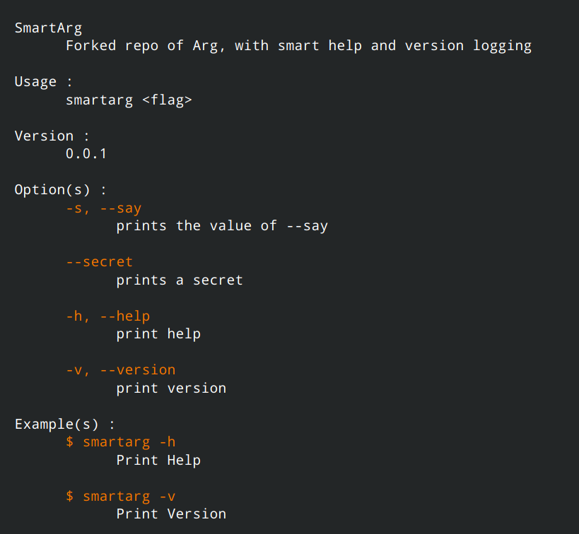

# Smart Arg 🤓

`Smart Arg` is a forked repo of [Arg](https://github.com/vercel/arg), with smart help and version logging.

## Installation

Use Yarn or NPM to install.

```console
$ yarn add smartarg
```

or

```console
$ npm install smartarg
```

## Usage
*all examples are in type script*
```
import SmartArg from "smartarg";

interface args {
    "--say": string,
    "--secret": boolean
}

const args: args = new SmartArg<args>()
    .name("SmartArg")
    .version("0.0.1")
    .description("Forked repo of Arg, with smart help and version logging")
    .option(["-s", "--say"], String, "prints the value of --say")
    .option(["--secret"], Boolean, "prints a secret")
    .smartParse()

if (args["--say"])
    console.log(`You asked me to say ${args["--say"]}`);
if (args["--secret"])
    console.log("Checkout @eadded/firejs. Best React Static Generator");
```

*Output on -h*



## Functions

```name(string)```          specify project name

```version(string)```       specify project version

```description(string)``` specify project description

```usage(string)``` specify commandline usage, default : ```name``` <flag>

```examples(string)``` specify an example, default : ```name``` -h

```primaryColor(number)``` specify [ANSI](https://en.wikipedia.org/wiki/ANSI_escape_code) color code, default : 1

```secondaryColor(number)``` specify [ANSI](https://en.wikipedia.org/wiki/ANSI_escape_code) color code, default : 33

```smartParse(config)``` terminates the program after printing help on ```[-h,--help]``` and version on ```[-v,--version]```, else returns [result](#result)

```parse(config)``` returns [result](#result)

## Result

It returns an object with any values present on the command-line (missing options are thus
missing from the resulting object). SmartArg performs no validation/requirement checking - we
leave that up to the application.

All parameters that aren't consumed by options (commonly referred to as "extra" parameters)
are added to `result._`, which is _always_ an array (even if no extra parameters are passed,
in which case an empty array is returned).

For example:

```console
$ node ./hello.js --verbose -vvv --port=1234 -n 'My name' foo bar --tag qux --tag=qix -- --foobar
```

```
// test.js
import SmartArg, {COUNT} from "smartarg";
interface args {
    "--verbose": string,
    "--port": boolean,
    "--name": string,
    "--tag": [string],
    "--label": string
}

const args: args = new SmartArg<args>()
    .option(["-v", "--verbose"], COUNT, "Counts the number of times --verbose is passed")
    .option(["-p", "--port"], COUNT, "Counts the number of times --verbose is passed")
    .option(["-n", "--name"], String, "Counts the number of times --verbose is passed")
    .option(["-t", "--tag"], [String], "Counts the number of times --verbose is passed")
    .option(["--label"], COUNT, "Counts the number of times --verbose is passed")
    .parse();

console.log(args);
/*
{
	_: ["foo", "bar", "--foobar"],
	'--port': 1234,
	'--verbose': 4,
	'--name': "My name",
	'--tag': ["qux", "qix"]
}
*/
```

The values for each key=&gt;value pair is either a type (function or [function]) or a string (indicating an alias).

- In the case of a function, the string value of the argument's value is passed to it,
  and the return value is used as the ultimate value.

- In the case of an array, the only element _must_ be a type function. Array types indicate
  that the argument may be passed multiple times, and as such the resulting value in the returned
  object is an array with all of the values that were passed using the specified flag.

- In the case of a string, an alias is established. If a flag is passed that matches the _key_,
  then the _value_ is substituted in its place.

Type functions are passed three arguments:

1. The parameter value (always a string)
2. The parameter name (e.g. `--label`)
3. The previous value for the destination (useful for reduce-like operations or for supporting `-v` multiple times, etc.)

This means the built-in `String`, `Number`, and `Boolean` type constructors "just work" as type functions.

Note that `Boolean` and `[Boolean]` have special treatment - an option argument is _not_ consumed or passed, but instead `true` is
returned. These options are called "flags".

For custom handlers that wish to behave as flags, you may pass the function through `flag()`:

```
import SmartArg, {flag} from "./SmartArg";

const argv = ['--foo', 'bar', '-ff', 'baz', '--foo', '--foo', 'qux', '-fff', 'qix'];

function myHandler(value, argName, previousValue) {
    /* `value` is always `true` */
    return 'na ' + (previousValue || 'batman!');
}

interface args {
    "--foo": string
}

const args = new SmartArg<args>()
    .option(["-f","--foo"], flag(myHandler),"")
    .parse({argv});

console.log(args);
/*
{
	_: ['bar', 'baz', 'qux', 'qix'],
	'--foo': 'na na na na na na na na batman!'
}
*/
```

As well, `SmartArg` supplies a helper argument handler called `COUNT`, which equivalent to a `[Boolean]` argument's `.length`
property - effectively counting the number of times the boolean flag, denoted by the key, is passed on the command line.

### Options

Object passed to `parse()` or `smartParse()` specifies parsing options to modify the behavior.

#### `argv`

If you have already sliced or generated a number of raw arguments to be parsed (as opposed to letting `SmartArg`
slice them from `process.argv`) you may specify them in the `argv` option.

#### `permissive`

When `permissive` set to `true`, `SmartArg` will push any unknown arguments
onto the "extra" argument array (`result._`) instead of throwing an error about
an unknown flag.

#### `stopAtPositional`

When `stopAtPositional` is set to `true`, `SmartArg` will halt parsing at the first
positional argument.

### Errors

Some errors that `SmartArg` throws provide a `.code` property in order to aid in recovering from user error, or to
differentiate between user error and developer error (bug).

##### ARG_UNKNOWN_OPTION

If an unknown option (not defined in the spec object) is passed, an error with code `ARG_UNKNOWN_OPTION` will be thrown

## License & Copyright
Copyright (C) 2020 Aniket Prajapati

Licensed under the [MIT LICENSE](LICENSE)

## Contributors
 + [Aniket Prajapati](https://github.com/aniketfuryrocks) @ prajapati.ani306@gmail.com , [eAdded](http://www.eadded.com)